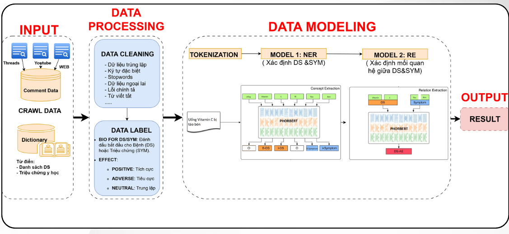
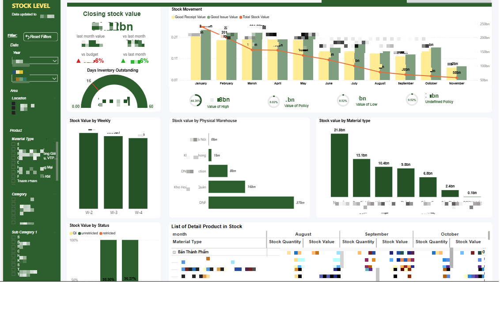
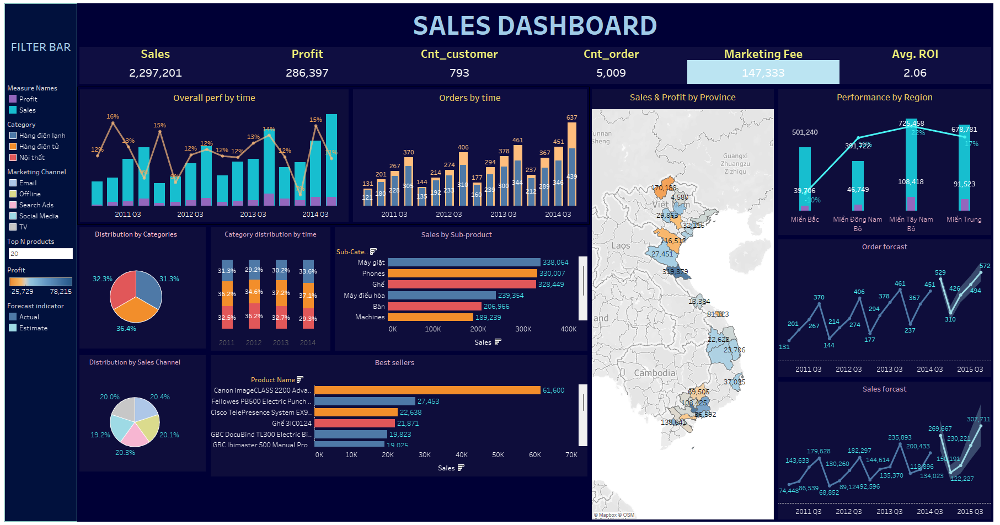
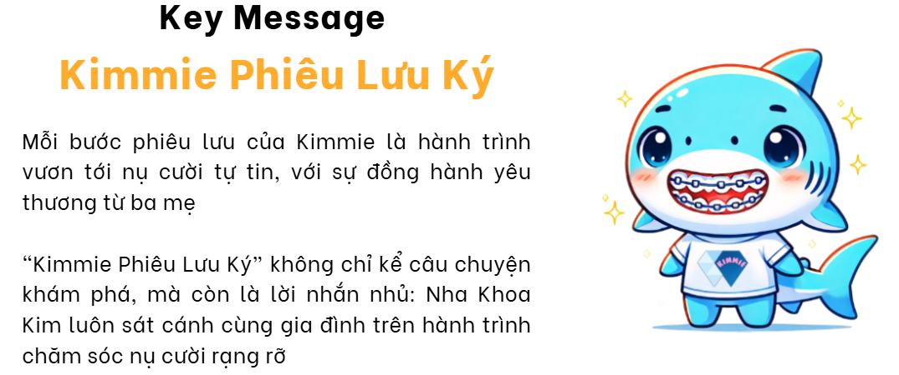
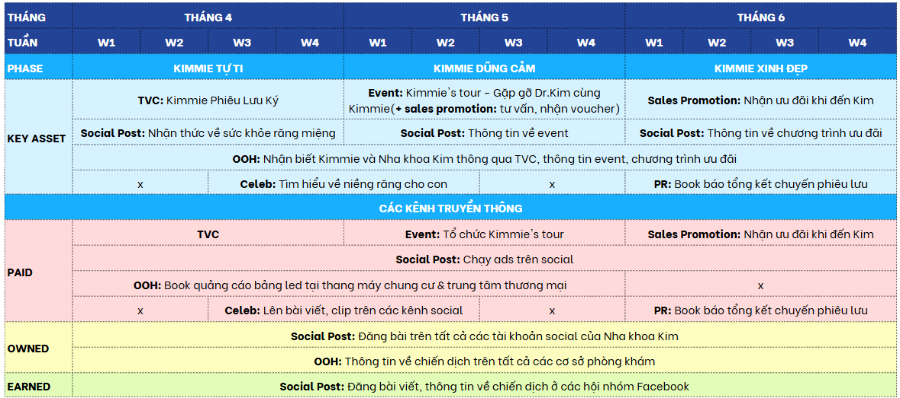

# 🎓 Paper reseach
## 1. Apply deep learning to detect Drug and Symtom on Social Media Comments
* RESULT 
** Build a model to detect and classify side effects from social media comments  
** Help early detection of side effects of drugs/nutritional supplements  
** Contribute ways to scrape data from Threads and a dictionary of medical names such as drugs/nutritional supplements/symptoms  
* MODEL

---
# 🎓 PROJECT
<!-- ## 1. Inventory Performance Dashboard (Power BI)
Demo data 

 -->

## 1. Sales Dashboard (Tableau)
Dataset: SuperStore 
Link: https://www.kaggle.com/datasets/vivek468/superstore-dataset-final 

---
# BUSINESS RESEARCH
## 1. IMC Plan for Nha Khoa Kim

<!-- <video controls>
<source src="../image/IMC.mp4" type="video/mp4">
</video> -->

<iframe width="100%" height="315" src="https://www.youtube.com/embed/E-VIC2bLs-M" frameborder="0" allowfullscreen></iframe>
